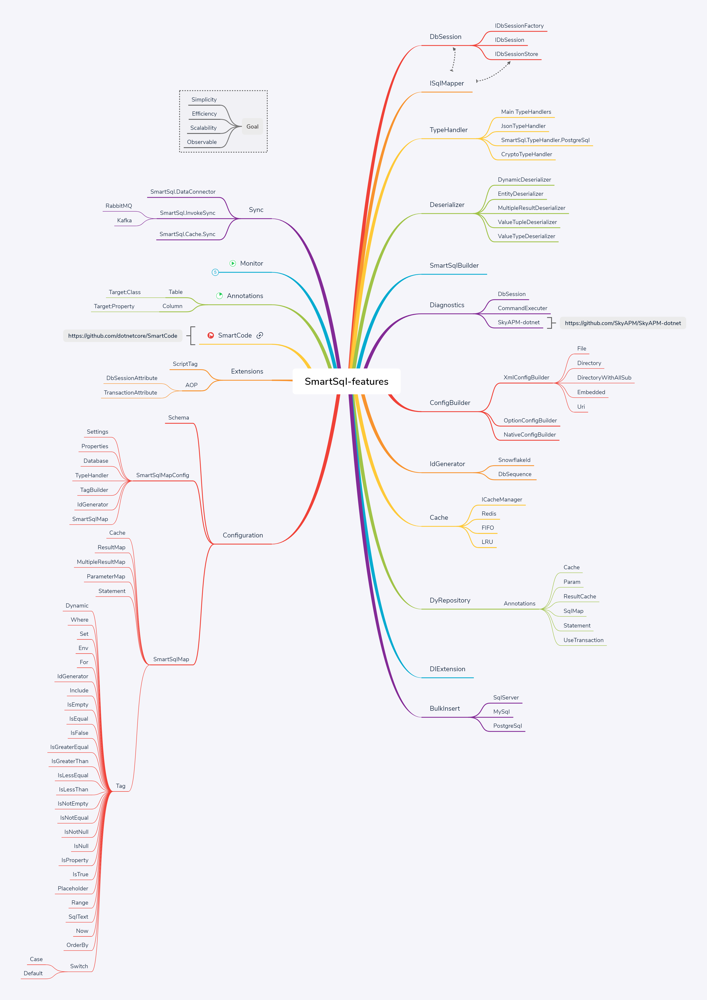
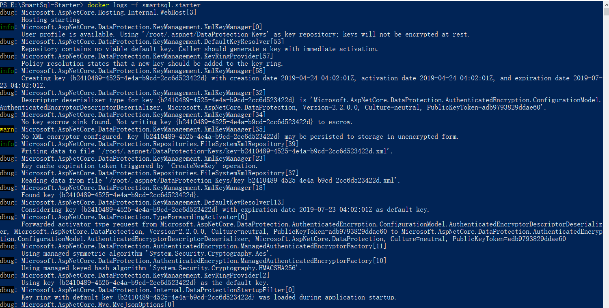

# 介绍

> SmartSql = MyBatis + Cache(Memory | Redis) + R/W Splitting +Dynamic Repository + Diagnostics ......
---
> 简洁、高效、高性能、扩展性、监控、渐进式开发！

## 她是如何工作的？

SmartSql 借鉴了 MyBatis 的思想，使用 XML 来管理 SQL ，并且提供了若干个筛选器标签来消除代码层面的各种 if/else 的判断分支。

SmartSql将管理你的 SQL ，并且通过筛选标签来维护本来你在代码层面的各种条件判断，使你的代码更加优美。

## 为什么选择 SmartSql ？

DotNet 体系下大都是 Linq 系的 ORM，Linq 很好，消除了开发人员对 SQL 的依赖。
但却忽视了一点，SQL 本身并不复杂，而且在复杂查询场景当中开发人员很难通过编写Linq来生成良好性能的SQL，相信使用过EF的同学一定有这样的体验：“我想好了Sql怎么写，然后再来写Linq,完了可能还要再查看一下Linq输出的Sql是什么样的“。这是非常糟糕的体验。要想对Sql做绝对的优化，那么开发者必须对Sql有绝对的控制权。另外Sql本身很简单，为何要增加一层翻译器呢？

> SmartSql 从正式开源已历经俩年多的时间，在生产环境经过若干个微服务验证。
> 同时也有一部分企业正在使用 SmartSql （如果您也在使用 SmartSql 欢迎提交issue）[Who is using SmartSql](https://github.com/dotnetcore/SmartSql/issues/13)。
> 目前已加入 [NCC](https://github.com/dotnetcore)。
> 未来([Roadmap-2019](https://github.com/dotnetcore/SmartSql/issues/47)) SmartSql 也会持续加入一些新的特性来帮助开发者提升效率。欢迎提交 Issue <https://github.com/dotnetcore/SmartSql/issues>。


## 那么为什么不是 Dapper，或者 DbHelper ？

Dapper 确实很好，并且又很好的性能，但是会让给你的代码里边充斥着 SQL 和各种判断分支，这些将会使代码维护难以阅读和维护。另外 Dapper 只提供了DataReader 到 Entity 的反序列化功能。而 SmartSql 提供了大量的特性来提升开发者的效率。

## 特性概览



## 动态仓储

动态代理仓储(SmartSql.DyRepository)组件是 SmartSql 非常独特的功能，它能简化 SmartSql 的使用。对业务代码几乎没有侵入。可以说使用 ISqlMapper 是原始方法，而 DyRepository 自动帮你实现这些方法。

DyRepository 的表现是只需要定义仓储接口，通过简单配置就能自动实现这些接口并注册到 IoC 容器中，使用时注入即刻获取实现。原理是通过接口和接口方法的命名规则来获取 SmartSql 的 xml 文件中的 Scope 和 SqlId ，用接口方法的参数作为 Request ，通过 xml 中的 sql 自动判断是查询还是执行操作，最后实现对 ISqlMapper 的调用。

### 0. 定义仓储接口

``` csharp
    public interface IUserRepository : IRepository<User, long>
    {
    }
```

### 1. 注入依赖

``` csharp
            services.AddSmartSql()
                .AddRepositoryFromAssembly(options => { options.AssemblyString = "SmartSql.Starter.Repository"; });
```

### 2. 使用

``` csharp
    public class UserService
    {
        IUserRepository userRepository;

        public UserService(IActivityRepository userRepository)
        {
            this.userRepository = userRepository;
        }
    }
```

## SmartSql 最佳实践 -> [SmartCode](https://github.com/dotnetcore/SmartCode)


通过 [SmartCode](https://github.com/dotnetcore/SmartCode) 开发人员仅需配置好数据库连接即可生成解决方案所需的一切，包括但不限于：

- 解决方案工程
- 帮你 restore 一下

``` yml
  ReStore:
    Type: Process
    Parameters: 
      FileName: powershell
      WorkingDirectory: '{{Project.Output.Path}}'
      Args: dotnet restore
```

- Docker
  - 构建 Docker 镜像 & 运行实例

``` yml
 BuildDocker:
    Type: Process
    Parameters:
      FileName: powershell
      WorkingDirectory: '{{Project.Output.Path}}'
      Args: docker build -t {{Project.Parameters.DockerImage}}:v1.0.0 .

  RunDocker:
    Type: Process
    Parameters:
      FileName: powershell
      WorkingDirectory: '{{Project.Output.Path}}'
      Args: docker run --name {{Project.Parameters.DockerImage}} --rm -d -p 8008:80 {{Project.Parameters.DockerImage}}:v1.0.0 .
```

- 顺便开启个浏览器

``` yml
  RunChrome:
    Type: Process
    Parameters:
      FileName: C:\Program Files (x86)\Google\Chrome\Application\chrome.exe
      CreateNoWindow: false
      Args: http://localhost:8008/swagger
```

### Docker




### SmartCode 生成的目录结构


## 读写分离

SmartSql 读写分离特别简便，仅需提供好配置即可：

``` xml
  <Database>
    <DbProvider Name="PostgreSql"/>
    <Write Name="WriteDB" ConnectionString="${Master}"/>
    <Read Name="ReadDb-1" ConnectionString="${Slave-0}" Weight="100"/>
    <Read Name="ReadDb-2" ConnectionString="${Slave-1}" Weight="100"/>
  </Database>
```

## 缓存

- Lru 最近最少使用算法
- Fifo 先进先出算法
- RedisCacheProvider
- 其他继承自ICacheProvider缓存类型均可

``` xml
<Caches>
    <Cache Id="LruCache" Type="Lru">
      <Property Name="CacheSize" Value="10"/>
      <FlushOnExecute Statement="AllPrimitive.Insert"/>
      <FlushInterval Hours="1" Minutes="0" Seconds="0"/>
    </Cache>
    <Cache Id="FifoCache" Type="Fifo">
      <Property Name="CacheSize" Value="10"/>
    </Cache>
    <Cache Id="RedisCache" Type="${RedisCacheProvider}">
      <Property Name="ConnectionString" Value="${Redis}" />
      <FlushInterval Seconds="60"/>
    </Cache>
  </Caches>
   <Statement Id="QueryByLruCache"  Cache="LruCache">
      SELECT Top 6 T.* From T_User T;
    </Statement>
```

## 类型处理器

SmartSql 内部实现了 DotNet 主要类型的类型处理器，并且提供了部分类型兼容的类型转换处理器，同时还提供了比较常用的 JsonTypeHanlder 。

``` xml
    <TypeHandler PropertyType="SmartSql.Test.Entities.UserInfo,SmartSql.Test" Type="${JsonTypeHandler`}">
      <Properties>
        <Property Name="DateFormat" Value="yyyy-MM-dd mm:ss"/>
        <Property Name="NamingStrategy" Value="Camel"/>
      </Properties>
    </TypeHandler>
```

## CUD 代码生成

SmartSql 同时提供了 CUD 扩展函数帮助开发者生成好 CUD-SQL ，方便开发者直接使用，无需编写任何配置。

``` csharp
public static TEntity GetById<TEntity, TPrimaryKey>(this ISqlMapper);
public static TPrimaryKey Insert<TEntity, TPrimaryKey>(this ISqlMapper sqlMapper, TEntity entity);
public static int DyUpdate<TEntity>(this ISqlMapper sqlMapper, object entity);
public static int Update<TEntity>(this ISqlMapper sqlMapper, TEntity entity);
public static int DeleteById<TEntity, TPrimaryKey>(this ISqlMapper sqlMapper, TPrimaryKey id);
public static int DeleteMany<TEntity, TPrimaryKey>(this ISqlMapper sqlMapper, IEnumerable<TPrimaryKey> ids);
```

## Id 生成器

### SnowflakeId

``` xml
<IdGenerators>
    <IdGenerator Name="SnowflakeId" Type="SnowflakeId">
      <Properties>
        <Property Name="WorkerIdBits" Value="10"/>
        <Property Name="WorkerId" Value="888"/>
        <Property Name="Sequence" Value="1"/>
      </Properties>
    </IdGenerator>
</IdGenerators>
```

``` xml
    <Statement Id="Insert">
      <IdGenerator Name="SnowflakeId" Id="Id"/>
      INSERT INTO T_UseIdGenEntity
      (
      Id,
      Name
      )
      VALUES
      (
      @Id,
      @Name
      );
      Select @Id;
    </Statement>
```

``` csharp
var id = SqlMapper.ExecuteScalar<long>(new RequestContext
            {
                Scope = nameof(UseIdGenEntity),
                SqlId = "Insert",
                Request = new UseIdGenEntity()
                {
                    Name = "SmartSql"
                }
            });
```

### DbSequence

``` xml
<IdGenerators>
    <IdGenerator Name="DbSequence" Type="DbSequence">
      <Properties>
        <Property Name="Step" Value="10"/>
        <Property Name="SequenceSql" Value="Select Next Value For IdSequence;"/>
      </Properties>
    </IdGenerator>
</IdGenerators>

```

``` xml
    <Statement Id="InsertByDbSequence">
      <IdGenerator Name="DbSequence" Id="Id"/>
      INSERT INTO T_UseIdGenEntity
      (
      Id,
      Name
      )
      VALUES
      (
      @Id,
      @Name
      );
      Select @Id;
    </Statement>
```

``` csharp
            var id = SqlMapper.ExecuteScalar<long>(new RequestContext
            {
                Scope = nameof(UseIdGenEntity),
                SqlId = "InsertByDbSequence",
                Request = new UseIdGenEntity()
                {
                    Name = "SmartSql"
                }
            });
```

## AOP 事务

``` csharp
        [Transaction]
        public virtual long AddWithTran(User user)
        {
            return _userRepository.Insert(user);
        }
```

### 事物嵌套

> 当出现事物嵌套时，子函数的事物特性注解将不再开启，转而使用上级调用函数的事物

``` csharp
        [Transaction]
        public virtual long AddWithTranWrap(User user)
        {
            return AddWithTran(user);
        }
```

## BulkInsert

``` csharp
using (var dbSession= SqlMapper.SessionStore.Open())
            {
                var data = SqlMapper.GetDataTable(new RequestContext
                {
                    Scope = nameof(AllPrimitive),
                    SqlId = "Query",
                    Request = new { Taken = 100 }
                });
                data.TableName = "T_AllPrimitive";
                IBulkInsert bulkInsert = new BulkInsert(dbSession);
                bulkInsert.Table = data;
                bulkInsert.Insert();
            }
```

## Skywalking 监控

SmartSql 目前支持 Skywalking 监控，通过安装 [SkyAPM-dotnet](https://github.com/SkyAPM/SkyAPM-dotnet) 代理来启用。以下是部分截图。

### 监控执行命令


### 查看是否缓存，以及返回的记录数


### 查看执行的SQL语句


### 事务


### 异常


### 异常堆栈跟踪


## Nuget Packages

| Package | NuGet Stable |  Downloads |
| ------- | -------- | ------- |
| [SmartSql](https://www.nuget.org/packages/SmartSql/) | [](https://www.nuget.org/packages/SmartSql/)  | [](https://www.nuget.org/packages/SmartSql/) |
| [SmartSql.Schema](https://www.nuget.org/packages/SmartSql.Schema/) | [](https://www.nuget.org/packages/SmartSql.Schema/)  | [](https://www.nuget.org/packages/SmartSql.Schema/) |
| [SmartSql.TypeHandler](https://www.nuget.org/packages/SmartSql.TypeHandler/) | [](https://www.nuget.org/packages/SmartSql.TypeHandler/)  | [](https://www.nuget.org/packages/SmartSql.TypeHandler/) |
| [SmartSql.DyRepository](https://www.nuget.org/packages/SmartSql.DyRepository/) | [](https://www.nuget.org/packages/SmartSql.DyRepository/)  | [](https://www.nuget.org/packages/SmartSql.DyRepository/) |
| [SmartSql.DIExtension](https://www.nuget.org/packages/SmartSql.DIExtension/) | [](https://www.nuget.org/packages/SmartSql.DIExtension/)  | [](https://www.nuget.org/packages/SmartSql.DIExtension/) |
| [SmartSql.Cache.Redis](https://www.nuget.org/packages/SmartSql.Cache.Redis/) | [](https://www.nuget.org/packages/SmartSql.Cache.Redis/)  | [](https://www.nuget.org/packages/SmartSql.Cache.Redis/) |
| [SmartSql.ScriptTag](https://www.nuget.org/packages/SmartSql.ScriptTag/) | [](https://www.nuget.org/packages/SmartSql.ScriptTag/)  | [](https://www.nuget.org/packages/SmartSql.ScriptTag/) |
| [SmartSql.AOP](https://www.nuget.org/packages/SmartSql.AOP/) | [](https://www.nuget.org/packages/SmartSql.AOP/)  | [](https://www.nuget.org/packages/SmartSql.AOP/) |
| [SmartSql.Options](https://www.nuget.org/packages/SmartSql.Options/) | [](https://www.nuget.org/packages/SmartSql.Options/)  | [](https://www.nuget.org/packages/SmartSql.Options/) |
| [SmartSql.Bulk](https://www.nuget.org/packages/SmartSql.Bulk/) | [](https://www.nuget.org/packages/SmartSql.Bulk/)  | [](https://www.nuget.org/packages/SmartSql.Bulk/) |
| [SmartSql.Bulk.SqlServer](https://www.nuget.org/packages/SmartSql.Bulk.SqlServer/) | [](https://www.nuget.org/packages/SmartSql.Bulk.SqlServer/)  | [](https://www.nuget.org/packages/SmartSql.Bulk.SqlServer/) |
| [SmartSql.Bulk.PostgreSql](https://www.nuget.org/packages/SmartSql.Bulk.PostgreSql/) | [](https://www.nuget.org/packages/SmartSql.Bulk.PostgreSql/)  | [](https://www.nuget.org/packages/SmartSql.Bulk.PostgreSql/)
| [SmartSql.Bulk.MySql](https://www.nuget.org/packages/SmartSql.Bulk.MySql/) | [](https://www.nuget.org/packages/SmartSql.Bulk.MySql/)  | [](https://www.nuget.org/packages/SmartSql.Bulk.MySql/) |
| [SmartSql.Bulk.MySqlConnector](https://www.nuget.org/packages/SmartSql.Bulk.MySqlConnector/) | [](https://www.nuget.org/packages/SmartSql.Bulk.MySqlConnector/)  | [](https://www.nuget.org/packages/SmartSql.Bulk.MySqlConnector/) |